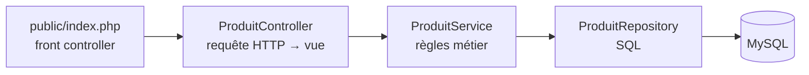

# TP pas à pas : application CRUD PHP / MySQL avec Docker Compose dans GitHub Codespaces

## Présentation

Dans ce TP, vous allez construire **fichier par fichier** une application web de gestion de produits :

- une page liste tous les produits de la table MySQL `produit` ;
- un bouton permet d'**ajouter** un produit ;
- chaque ligne propose de **modifier** ou de **supprimer** le produit.

L'application est organisée en couches : **Modèle**, **Repository** (opérations CRUD en SQL), **Service** (règles métier), **Contrôleur** et **Vues**. L'environnement (PHP/Apache + MySQL) tourne dans **Docker Compose**, à l'intérieur d'un **GitHub Codespace**.

**Prérequis** : compte GitHub, bases de PHP objet et de SQL.
**Durée indicative** : 5 h.

### Déroulé

| Étape | Ce que vous construisez | Ce que vous testez |
|---|---|---|
| 0 | Démarrage de l'environnement (fourni) | Conteneurs lancés, base remplie |
| 1 | Premier script PHP | PHP répond dans le navigateur |
| 2 | Connexion à la base (`Database`) + autoloader | Nombre de produits affiché |
| 3 | Modèle `Produit` | Conversion d'une ligne SQL en objet |
| 4 | Repository : lecture (`findAll`, `findById`) | Liste brute des produits |
| 5 | Vues : layout et liste HTML | Tableau mis en forme, protection XSS |
| 6 | Service, contrôleur, front controller | Même affichage, architecture propre |
| 7 | **Create** : formulaire d'ajout | Ajout d'un produit, protection CSRF |
| 8 | Validation des données | Messages d'erreur sur le formulaire |
| 9 | **Update** : modification | Modification d'un produit |
| 10 | **Delete** : suppression | Suppression d'un produit |
| 11 | Bilan et exercices | |

### Comment lire ce TP

Chaque étape suit le même plan : **objectif**, **fichiers** à créer ou à modifier (code complet), **explications** des lignes importantes, puis **test** à réaliser pour voir le résultat. Ne passez à l'étape suivante que lorsque le test fonctionne.

Quand un fichier existant est modifié, le TP indique précisément quoi remplacer ou où ajouter le code.

---

# Partie 1 : l'environnement (fourni)

## Étape 0 : Démarrer le Codespace et les conteneurs

### 0.1 Créer le Codespace

1. Poussez le dépôt de démarrage sur votre compte GitHub.
2. Sur la page du dépôt : **Code** → onglet **Codespaces** → **Create codespace on main**.
3. Attendez la fin de la construction. Le terminal affiche :
   ```
   ✅ Docker est prêt : Docker version ...
   👉 Lancez la stack avec : docker compose up -d --build
   ```

### 0.2 Ce que contient le dépôt

```
.
├── .devcontainer/
│   ├── devcontainer.json          # définition du Codespace
│   └── post-start.sh              # attend que Docker soit prêt
├── docker/
│   ├── php/Dockerfile             # image PHP 8.3 + Apache
│   └── mysql/init/01-schema.sql   # création de la table produit + 5 produits
├── app/
│   └── public/css/style.css       # feuille de style (fournie)
├── docker-compose.yml
├── .env.example                   # identifiants de la base
└── .gitignore
```

Le dossier `app/` est **le seul** dans lequel vous travaillerez. Il est monté dans le conteneur web : chaque fichier que vous y enregistrez est immédiatement visible par Apache, **sans reconstruire l'image**.

Les points clés de l'infrastructure :

| Fichier | Ce qu'il faut retenir |
|---|---|
| `devcontainer.json` | La feature `docker-in-docker` installe Docker dans le Codespace et démarre son démon. `postCreateCommand` copie `.env.example` en `.env`. Les ports 8080 et 8081 sont redirigés vers votre navigateur. |
| `docker-compose.yml` | Trois services : `web` (PHP/Apache, port 8080), `db` (MySQL 8.4) et `phpmyadmin` (port 8081). Le service `web` attend que `db` soit **healthy** avant de démarrer. Les identifiants de la base lui sont transmis par variables d'environnement (`DB_HOST`, `DB_NAME`…). |
| `docker/php/Dockerfile` | Part de l'image officielle `php:8.3-apache`, installe l'extension `pdo_mysql` et fait pointer Apache sur `app/public/`. Les dossiers `src/` et `templates/` que vous allez créer resteront donc **inaccessibles depuis le navigateur**. |
| `01-schema.sql` | Exécuté par MySQL **uniquement au premier démarrage** (volume vide). Crée la table `produit` et insère 5 produits. |

### 0.3 Lancer la stack

Dans le terminal du Codespace :

```bash
docker compose up -d --build
```

| Élément | Signification |
|---|---|
| `up` | crée et démarre les conteneurs décrits dans `docker-compose.yml` |
| `-d` | mode détaché : les conteneurs tournent en arrière-plan, le terminal reste disponible |
| `--build` | construit l'image PHP à partir du `Dockerfile` |

Vérifiez l'état des services :

```bash
docker compose ps
```

> **✅ Test 0.a** : les trois services sont `running` et `db` affiche `(healthy)`. Si `db` indique `(health: starting)`, patientez 20 secondes et relancez la commande.

### 0.4 Vérifier la base de données

```bash
docker compose exec db mysql -u tp_user -ptp_password tp_crud -e "SELECT id, nom, prix, stock FROM produit;"
```

`docker compose exec db` exécute une commande **dans** le conteneur `db` ; ici le client `mysql` connecté à la base `tp_crud`.

> **✅ Test 0.b** : les 5 produits s'affichent (Clavier mécanique, Souris sans fil, Écran 27 pouces, Station d'accueil, Casque audio).

### 0.5 Ouvrir le serveur web

Ouvrez l'onglet **PORTS** de VS Code, survolez le port **8080** et cliquez sur l'icône globe.

> **✅ Test 0.c** : une page « Index of / » s'affiche avec le dossier `css/`. Apache fonctionne ; il n'y a simplement pas encore de page d'accueil. C'est ce que vous allez créer.

---

# Partie 2 : l'application PHP, pas à pas

À la fin de cette partie, le dossier `app/` aura cette structure :

```
app/
├── public/
│   ├── index.php                      # étapes 1 à 10
│   └── css/style.css                  # fourni
├── src/
│   ├── Config/Database.php            # étape 2
│   ├── Model/Produit.php              # étape 3
│   ├── Repository/ProduitRepository.php   # étapes 4, 7, 9, 10
│   ├── Service/ProduitService.php     # étapes 6 à 10
│   ├── Controller/ProduitController.php   # étapes 6 à 10
│   ├── Exception/
│   │   ├── ValidationException.php    # étape 8
│   │   └── ProduitIntrouvableException.php   # étape 9
│   └── helpers.php                    # étapes 5 et 7
└── templates/
    ├── layout.php                     # étapes 5 et 7
    ├── liste.php                      # étapes 5, 7, 9, 10
    └── formulaire.php                 # étape 7
```

---

## Étape 1 : Premier script PHP

### Objectif

Vérifier que PHP est bien exécuté par Apache et qu'il reçoit les variables d'environnement définies dans `docker-compose.yml`.

### Fichier à créer : `app/public/index.php`

```php
<?php
declare(strict_types=1);

echo '<h1>Bonjour depuis PHP ' . PHP_VERSION . '</h1>';
echo '<p>Serveur : ' . $_SERVER['SERVER_SOFTWARE'] . '</p>';
echo '<p>Hôte de la base : ' . getenv('DB_HOST') . '</p>';
echo '<p>Nom de la base : ' . getenv('DB_NAME') . '</p>';
```

### Explications

| Ligne | Explication |
|---|---|
| `<?php` | Ouvre un bloc PHP. Dans un fichier qui ne contient que du PHP, on **ne ferme pas** la balise : cela évite d'envoyer par erreur des espaces ou retours à la ligne au navigateur. |
| `declare(strict_types=1);` | Active le typage strict : si une fonction attend un `int` et reçoit la chaîne `"5"`, PHP lève une erreur au lieu de convertir silencieusement. On le met en tête de **chaque** fichier du projet. |
| `PHP_VERSION` | Constante prédéfinie contenant la version de PHP (ici 8.3.x). |
| `.` | Opérateur de concaténation de chaînes. |
| `$_SERVER['SERVER_SOFTWARE']` | Tableau superglobal rempli par le serveur web. Ici : le nom et la version d'Apache. |
| `getenv('DB_HOST')` | Lit une variable d'environnement du conteneur. Sa valeur vient de la section `environment` du service `web` dans `docker-compose.yml`. |

### Test

> **✅ Test 1** : rechargez l'onglet du port 8080. La page affiche la version de PHP, `Apache/2.4…`, l'hôte de la base `db` et le nom de la base `tp_crud`.
>
> Modifiez le texte du `<h1>`, enregistrez, rechargez : la modification est visible immédiatement. C'est l'effet du **bind mount** `./app:/var/www/html`.

**Pourquoi l'hôte de la base est-il `db` et non `localhost` ?** Chaque conteneur a son propre réseau local. Pour le conteneur `web`, `localhost` désigne le conteneur `web` lui-même. Docker Compose crée un réseau commun dans lequel chaque service est joignable **par son nom** : `db`.

---

## Étape 2 : Se connecter à la base de données

### Objectif

Créer une classe qui fournit **une seule** connexion PDO à MySQL pour toute l'application, et mettre en place le chargement automatique des classes.

### Fichier à créer : `app/src/Config/Database.php`

```php
<?php
declare(strict_types=1);

namespace App\Config;

use PDO;

/**
 * Fournit une connexion PDO unique (lue depuis les variables d'environnement
 * définies dans docker-compose.yml).
 */
final class Database
{
    private static ?PDO $pdo = null;

    public static function getConnection(): PDO
    {
        if (self::$pdo === null) {
            $dsn = sprintf(
                'mysql:host=%s;port=%s;dbname=%s;charset=utf8mb4',
                getenv('DB_HOST') ?: 'db',
                getenv('DB_PORT') ?: '3306',
                getenv('DB_NAME') ?: 'tp_crud'
            );

            self::$pdo = new PDO($dsn, getenv('DB_USER') ?: '', getenv('DB_PASSWORD') ?: '', [
                PDO::ATTR_ERRMODE            => PDO::ERRMODE_EXCEPTION, // erreurs SQL => exceptions
                PDO::ATTR_DEFAULT_FETCH_MODE => PDO::FETCH_ASSOC,
                PDO::ATTR_EMULATE_PREPARES   => false,                  // vraies requêtes préparées
            ]);
        }
        return self::$pdo;
    }
}
```

### Explications

| Ligne(s) | Explication |
|---|---|
| `namespace App\Config;` | Range la classe dans un **espace de noms**. Son nom complet est `App\Config\Database`. Tout le projet utilise le préfixe `App\`. |
| `use PDO;` | `PDO` est une classe native de PHP, placée dans l'espace de noms global. Ce `use` permet d'écrire `PDO` au lieu de `\PDO`. |
| `final class` | La classe ne peut pas être héritée. Bonne pratique par défaut : on n'ouvre l'héritage que si on en a besoin. |
| `private static ?PDO $pdo = null;` | Propriété **statique** : elle appartient à la classe, pas à un objet, et conserve la connexion entre deux appels. `?PDO` signifie « un objet PDO ou `null` ». |
| `if (self::$pdo === null)` | On ne crée la connexion qu'au premier appel ; les appels suivants renvoient la même. C'est le principe du **singleton**. |
| `$dsn = sprintf(...)` | Le **DSN** (Data Source Name) décrit où se connecter : pilote `mysql`, hôte, port, base et jeu de caractères. `sprintf` remplace chaque `%s` par les arguments suivants. |
| `getenv('DB_HOST') ?: 'db'` | L'opérateur `?:` renvoie la valeur de gauche si elle est « vraie », sinon celle de droite. `getenv()` renvoie `false` si la variable n'existe pas : on a alors une valeur par défaut. |
| `charset=utf8mb4` | Encodage UTF-8 complet (accents, emojis). Il doit correspondre à celui de la table. |
| `new PDO($dsn, $utilisateur, $motDePasse, [options])` | Ouvre la connexion. Le mot de passe n'est **jamais** écrit dans le code : il vient de l'environnement. |
| `ATTR_ERRMODE => ERRMODE_EXCEPTION` | Toute erreur SQL lève une `PDOException`. Sans cette option, une requête en échec renvoie simplement `false` et l'erreur passe inaperçue. |
| `ATTR_DEFAULT_FETCH_MODE => FETCH_ASSOC` | Les lignes lues sont des tableaux associatifs : `$ligne['nom']`. |
| `ATTR_EMULATE_PREPARES => false` | Les requêtes préparées sont réellement envoyées à MySQL en deux temps (requête, puis valeurs), ce qui renforce la protection contre l'injection SQL. |

### Fichier à modifier : `app/public/index.php`

Remplacez **tout** le contenu par :

```php
<?php
declare(strict_types=1);

// Autoloader PSR-4 minimal : App\Model\Produit => src/Model/Produit.php
spl_autoload_register(function (string $classe): void {
    $prefixe = 'App\\';
    if (!str_starts_with($classe, $prefixe)) {
        return;
    }
    $fichier = dirname(__DIR__) . '/src/' . str_replace('\\', '/', substr($classe, strlen($prefixe))) . '.php';
    if (is_file($fichier)) {
        require $fichier;
    }
});

use App\Config\Database;

$pdo = Database::getConnection();
$nombre = $pdo->query('SELECT COUNT(*) FROM produit')->fetchColumn();

echo "<p>Connexion réussie : $nombre produit(s) en base.</p>";
```

### Explications

| Ligne(s) | Explication |
|---|---|
| `spl_autoload_register(function ...)` | Enregistre une fonction que PHP appelle **automatiquement** la première fois qu'on utilise une classe inconnue. Plus besoin d'écrire un `require` par classe. |
| `$prefixe = 'App\\';` | Dans une chaîne PHP, `\\` représente un seul antislash. On ne gère que nos propres classes, celles qui commencent par `App\`. |
| `substr($classe, strlen($prefixe))` | Retire le préfixe : `App\Config\Database` devient `Config\Database`. |
| `str_replace('\\', '/', ...)` | Transforme les antislashs du namespace en séparateurs de dossiers : `Config/Database`. |
| `dirname(__DIR__) . '/src/' ... '.php'` | `__DIR__` est le dossier du fichier courant (`app/public`) ; `dirname()` remonte d'un niveau (`app`). Résultat : `app/src/Config/Database.php`. Cette convention namespace = dossier s'appelle **PSR-4**. |
| `use App\Config\Database;` | Permet d'écrire `Database` au lieu du nom complet. |
| `$pdo->query('SELECT COUNT(*) FROM produit')` | Exécute une requête **sans paramètre**. `query()` n'est acceptable que si la requête ne contient aucune donnée venant de l'utilisateur. |
| `->fetchColumn()` | Renvoie la valeur de la première colonne de la première ligne : le nombre de produits. |
| `"... $nombre ..."` | Entre guillemets doubles, PHP remplace les variables par leur valeur (interpolation). |

### Tests

> **✅ Test 2.a** : rechargez la page. Elle affiche « Connexion réussie : 5 produit(s) en base. »

> **✅ Test 2.b (erreur volontaire)** : arrêtez la base puis rechargez la page.
> ```bash
> docker compose stop db
> ```
> Une erreur `Fatal error: Uncaught PDOException: SQLSTATE[HY000] [2002]…` s'affiche : l'exception n'est rattrapée nulle part. Vous la gérerez proprement à l'étape 6. Redémarrez la base :
> ```bash
> docker compose start db
> ```

---

## Étape 3 : Le modèle `Produit`

### Objectif

Représenter un enregistrement de la table `produit` par un **objet PHP** plutôt que par un tableau. Le modèle ne connaît ni la base de données, ni le HTML.

### Fichier à créer : `app/src/Model/Produit.php`

```php
<?php
declare(strict_types=1);

namespace App\Model;

/**
 * Modèle : représente un enregistrement de la table `produit`.
 * Il ne connaît ni la base de données, ni le HTML.
 */
final class Produit
{
    public function __construct(
        private ?int $id,
        private string $nom,
        private string $description,
        private float $prix,
        private int $stock,
    ) {
    }

    /** Construit un Produit à partir d'une ligne SQL. */
    public static function fromArray(array $ligne): self
    {
        return new self(
            isset($ligne['id']) ? (int) $ligne['id'] : null,
            (string) $ligne['nom'],
            (string) ($ligne['description'] ?? ''),
            (float) $ligne['prix'],
            (int) $ligne['stock'],
        );
    }

    /** Retourne une copie du produit avec l'identifiant attribué par la base. */
    public function withId(int $id): self
    {
        $copie = clone $this;
        $copie->id = $id;
        return $copie;
    }

    public function getId(): ?int
    {
        return $this->id;
    }

    public function getNom(): string
    {
        return $this->nom;
    }

    public function getDescription(): string
    {
        return $this->description;
    }

    public function getPrix(): float
    {
        return $this->prix;
    }

    public function getStock(): int
    {
        return $this->stock;
    }

    public function estEnRupture(): bool
    {
        return $this->stock === 0;
    }
}
```

### Explications

| Ligne(s) | Explication |
|---|---|
| `public function __construct(private ?int $id, ...)` | **Promotion des propriétés du constructeur** (PHP 8) : déclarer `private` devant un paramètre crée la propriété et l'initialise en une seule ligne. Sans cela, il faudrait déclarer 5 propriétés puis écrire 5 affectations `$this->id = $id;`. |
| `?int $id` | L'identifiant peut être `null` : un produit qui n'est pas encore enregistré n'a pas d'id (c'est MySQL qui l'attribue avec `AUTO_INCREMENT`). |
| propriétés `private` | On ne peut pas modifier un produit de l'extérieur par `$produit->prix = -5`. L'accès se fait par les **getters**. C'est l'**encapsulation**. |
| `public static function fromArray(array $ligne): self` | **Méthode de fabrique** : construit un objet à partir d'une ligne SQL. `static` : on l'appelle sur la classe, `Produit::fromArray($ligne)`. `self` : elle renvoie un `Produit`. |
| `(int)`, `(float)`, `(string)` | **Conversions explicites**. PDO renvoie les colonnes `DECIMAL` sous forme de chaîne (`"89.90"`) ; avec `strict_types`, passer cette chaîne à un paramètre `float` provoquerait une erreur. |
| `$ligne['description'] ?? ''` | Opérateur de **coalescence nulle** : si la description est `NULL` en base, on prend une chaîne vide. |
| `withId(int $id): self` | Renvoie une **copie** du produit avec un id. `clone` duplique l'objet : l'original n'est pas modifié. On s'en servira après un `INSERT`. |
| `estEnRupture()` | Une petite règle métier portée par le modèle : un produit est en rupture si son stock vaut 0. La vue s'en servira pour afficher un badge. |

### Test

Remplacez la fin de `app/public/index.php` (tout ce qui suit l'autoloader) par :

```php
use App\Config\Database;
use App\Model\Produit;

$pdo = Database::getConnection();
$ligne = $pdo->query('SELECT * FROM produit WHERE id = 1')->fetch();
$produit = Produit::fromArray($ligne);

echo '<h2>Ligne SQL (tableau)</h2><pre>';
var_dump($ligne);
echo '</pre><h2>Objet Produit</h2><pre>';
var_dump($produit);
echo '</pre>';
```

> **✅ Test 3** : rechargez la page et comparez les deux affichages.
> - Dans le tableau, `id` est un `int` mais `prix` est une **chaîne** `"89.90"`, et on trouve aussi les colonnes `cree_le` et `modifie_le`.
> - Dans l'objet, `prix` est un **float** `89.9`, et seules les 5 propriétés du modèle sont présentes.
>
> Le modèle a « nettoyé » et typé les données.

---

## Étape 4 : Le repository, lecture des données (le R de CRUD)

### Objectif

Regrouper **toutes** les requêtes SQL sur la table `produit` dans une seule classe : le **repository**. Le reste de l'application ne manipulera que des objets `Produit` et n'écrira jamais de SQL.

On commence par la lecture : tous les produits, puis un produit par son id.

### Fichier à créer : `app/src/Repository/ProduitRepository.php`

```php
<?php
declare(strict_types=1);

namespace App\Repository;

use App\Model\Produit;
use PDO;

/**
 * Repository : seule classe qui écrit du SQL pour la table `produit`.
 * Opérations CRUD : Create (insert), Read (findAll / findById), Update, Delete.
 */
final class ProduitRepository
{
    public function __construct(private PDO $pdo)
    {
    }

    /** @return Produit[] */
    public function findAll(): array
    {
        $stmt = $this->pdo->query(
            'SELECT id, nom, description, prix, stock FROM produit ORDER BY id'
        );
        return array_map([Produit::class, 'fromArray'], $stmt->fetchAll());
    }

    public function findById(int $id): ?Produit
    {
        $stmt = $this->pdo->prepare(
            'SELECT id, nom, description, prix, stock FROM produit WHERE id = :id'
        );
        $stmt->execute(['id' => $id]);
        $ligne = $stmt->fetch();

        return $ligne === false ? null : Produit::fromArray($ligne);
    }

    // Étape 7 : insert()
    // Étape 9 : update()
    // Étape 10 : delete()
}
```

### Explications

| Ligne(s) | Explication |
|---|---|
| `__construct(private PDO $pdo)` | Le repository **reçoit** la connexion au lieu d'appeler lui-même `Database::getConnection()`. C'est l'**injection de dépendance** : on pourrait lui donner une autre connexion (base de test par exemple) sans modifier la classe. |
| `/** @return Produit[] */` | Commentaire PHPDoc. Le type `array` de PHP ne dit pas ce que contient le tableau ; ce commentaire l'indique à l'éditeur (autocomplétion) et au lecteur. |
| `SELECT id, nom, description, prix, stock` | On liste les colonnes utiles plutôt que `SELECT *` : la requête ne ramène que ce dont le modèle a besoin, et ne change pas de comportement si on ajoute des colonnes à la table. |
| `$stmt->fetchAll()` | Récupère toutes les lignes sous forme de tableau de tableaux associatifs. |
| `array_map([Produit::class, 'fromArray'], ...)` | Applique `Produit::fromArray()` à chaque ligne et renvoie le tableau des résultats : on obtient un tableau d'objets `Produit`. `Produit::class` vaut la chaîne `'App\Model\Produit'`. |
| `$this->pdo->prepare('... WHERE id = :id')` | **Requête préparée** : la requête contient un **paramètre nommé** `:id` au lieu de la valeur. MySQL analyse la requête **avant** de connaître la valeur. |
| `$stmt->execute(['id' => $id])` | Envoie la valeur du paramètre. Elle est traitée comme une **donnée**, jamais comme du SQL : c'est la protection contre l'**injection SQL**. |
| `$stmt->fetch()` | Lit une seule ligne. Renvoie `false` s'il n'y en a pas. |
| `?Produit` et `$ligne === false ? null : ...` | Si l'id n'existe pas, la méthode renvoie `null` plutôt que de planter. C'est à l'appelant de décider quoi faire. |

**À retenir** : `query()` pour une requête **sans** donnée variable, `prepare()` + `execute()` **dès qu'une valeur** entre dans la requête. Ne jamais concaténer une variable dans du SQL : `"... WHERE id = " . $_GET['id']` permettrait à un utilisateur d'injecter `1 OR 1=1`.

### Test

Remplacez la fin de `app/public/index.php` (après l'autoloader) par :

```php
use App\Config\Database;
use App\Repository\ProduitRepository;

$repository = new ProduitRepository(Database::getConnection());

echo '<h2>findAll()</h2><ul>';
foreach ($repository->findAll() as $produit) {
    echo '<li>' . $produit->getId() . ' - ' . $produit->getNom() . ' : ' . $produit->getPrix() . ' €</li>';
}
echo '</ul>';

$id = (int) ($_GET['id'] ?? 1);
$produit = $repository->findById($id);

echo "<h2>findById($id)</h2>";
echo $produit === null ? 'Aucun produit avec cet id.' : $produit->getNom();
```

> **✅ Test 4** :
> - la page liste les 5 produits, puis affiche « findById(1) : Clavier mécanique » ;
> - ajoutez `?id=3` à la fin de l'URL : « Écran 27 pouces » ;
> - essayez `?id=999` : « Aucun produit avec cet id. »
>
> ⚠️ Ce code de test affiche les données **sans les échapper**. Ce défaut de sécurité est corrigé à l'étape suivante.

---

## Étape 5 : Les vues, afficher la liste en HTML

### Objectif

Séparer le **HTML** du code PHP de traitement. On crée :

- une fonction `e()` pour échapper les données affichées ;
- un **layout** : la structure commune à toutes les pages (en-tête, CSS) ;
- une vue **liste** : le tableau des produits, insérée dans le layout.

### Fichier à créer : `app/src/helpers.php`

```php
<?php
declare(strict_types=1);

/** Échappe une valeur pour l'afficher dans du HTML (protection XSS). */
function e(mixed $valeur): string
{
    return htmlspecialchars((string) $valeur, ENT_QUOTES, 'UTF-8');
}
```

| Ligne(s) | Explication |
|---|---|
| `function e(mixed $valeur): string` | Fonction globale au nom très court, car on l'appellera à chaque affichage. `mixed` : elle accepte n'importe quel type (chaîne, entier, float…). |
| `htmlspecialchars(...)` | Convertit les caractères spéciaux HTML en entités : `<` devient `&lt;`, `"` devient `&quot;`… Le navigateur les **affiche** au lieu de les **interpréter**. |
| `ENT_QUOTES` | Échappe aussi les apostrophes, indispensable quand la valeur est placée dans un attribut HTML (`value='...'`). |

**Pourquoi ?** Si un utilisateur enregistre comme nom de produit `<script>…</script>`, sans échappement ce script s'exécuterait chez **tous** les visiteurs de la liste. C'est une faille **XSS** (Cross-Site Scripting). Règle : **toute donnée affichée passe par `e()`**.

### Fichier à créer : `app/templates/layout.php`

```php
<?php /** @var string $titre  @var string $contenu */ ?>
<!DOCTYPE html>
<html lang="fr">
<head>
    <meta charset="UTF-8">
    <meta name="viewport" content="width=device-width, initial-scale=1">
    <title><?= e($titre) ?> | Catalogue</title>
    <link rel="stylesheet" href="css/style.css">
</head>
<body>
<header class="entete">
    <div class="conteneur entete-contenu">
        <a href="index.php" class="marque">Catalogue</a>
        <span class="pile">PHP 8.3 + Apache, MySQL 8.4</span>
    </div>
</header>

<main class="conteneur">
    <?= $contenu ?>
</main>
</body>
</html>
```

| Ligne(s) | Explication |
|---|---|
| `/** @var string $titre ... */` | Indique à l'éditeur quelles variables la vue s'attend à recevoir. |
| `<?= ... ?>` | Raccourci de `<?php echo ... ?>`. Idéal dans les vues. |
| `<?= e($titre) ?>` | Le titre de page est échappé. |
| `<?= $contenu ?>` | Le contenu de la page (le tableau) est inséré **sans** `e()` : c'est du HTML que **nous** avons produit, et les données qu'il contient ont déjà été échappées dans la vue liste. |
| `href="css/style.css"` | Chemin relatif vers la feuille de style fournie dans `public/css/`. |

### Fichier à créer : `app/templates/liste.php`

```php
<?php /** @var \App\Model\Produit[] $produits  @var string $titre */ ?>
<div class="barre-titre">
    <h1><?= e($titre) ?> <span class="compteur"><?= count($produits) ?></span></h1>
    <!-- Étape 7 : bouton « Ajouter un produit » -->
</div>

<?php if ($produits === []): ?>
    <div class="vide">
        <p>Le catalogue est vide. Ajoutez un premier produit avec le bouton ci-dessus.</p>
    </div>
<?php else: ?>
    <div class="tableau-conteneur">
        <table>
            <thead>
            <tr>
                <th scope="col">N°</th>
                <th scope="col">Nom</th>
                <th scope="col">Description</th>
                <th scope="col" class="num">Prix</th>
                <th scope="col" class="num">Stock</th>
                <th scope="col"><span class="visuellement-cache">Actions</span></th>
            </tr>
            </thead>
            <tbody>
            <?php foreach ($produits as $produit): ?>
                <tr>
                    <td class="id"><?= e($produit->getId()) ?></td>
                    <td class="nom"><?= e($produit->getNom()) ?></td>
                    <td class="description"><?= e($produit->getDescription()) ?></td>
                    <td class="num"><?= e(number_format($produit->getPrix(), 2, ',', ' ')) ?> €</td>
                    <td class="num">
                        <?php if ($produit->estEnRupture()): ?>
                            <span class="badge-rupture">Rupture</span>
                        <?php else: ?>
                            <?= e($produit->getStock()) ?>
                        <?php endif; ?>
                    </td>
                    <td class="actions">
                        <!-- Étapes 9 et 10 : boutons Modifier et Supprimer -->
                    </td>
                </tr>
            <?php endforeach; ?>
            </tbody>
        </table>
    </div>
<?php endif; ?>
```

| Ligne(s) | Explication |
|---|---|
| `if (...): ... else: ... endif;` | **Syntaxe alternative** des structures de contrôle. Dans un template, elle est plus lisible que les accolades noyées dans le HTML. Idem pour `foreach (...): ... endforeach;`. |
| `$produits === []` | Teste si le tableau est vide pour afficher un message plutôt qu'un tableau sans ligne. |
| `count($produits)` | Nombre d'éléments, affiché dans la pastille à côté du titre. Un entier ne peut pas contenir de HTML : pas besoin de `e()`. |
| `scope="col"` | Accessibilité : indique aux lecteurs d'écran que la cellule est l'en-tête de sa colonne. |
| `number_format($prix, 2, ',', ' ')` | Formate le prix à la française : 2 décimales, virgule décimale, espace pour les milliers (`1 249,00`). |
| `$produit->estEnRupture()` | La vue utilise la règle du modèle au lieu de tester `getStock() === 0` elle-même. |
| `<!-- Étapes 9 et 10 ... -->` | Emplacement réservé pour les boutons qui arriveront plus tard. |

### Fichier à modifier : `app/public/index.php`

Remplacez la fin (après l'autoloader) par :

```php
require dirname(__DIR__) . '/src/helpers.php';

use App\Config\Database;
use App\Repository\ProduitRepository;

$repository = new ProduitRepository(Database::getConnection());

$titre = 'Produits';
$produits = $repository->findAll();

ob_start();
require dirname(__DIR__) . '/templates/liste.php';
$contenu = ob_get_clean();

require dirname(__DIR__) . '/templates/layout.php';
```

| Ligne(s) | Explication |
|---|---|
| `require .../helpers.php` | Les fonctions ne sont pas chargées par l'autoloader (qui ne gère que les classes) : on les inclut explicitement. |
| `$titre`, `$produits` | Les variables définies ici sont visibles dans les fichiers inclus par `require` : c'est ainsi qu'on transmet les données aux vues. |
| `ob_start()` | Démarre la **mise en tampon** : ce qui est affiché n'est plus envoyé au navigateur mais stocké en mémoire. |
| `require .../liste.php` | La vue produit son HTML… dans le tampon. |
| `$contenu = ob_get_clean()` | Récupère le contenu du tampon dans une variable et arrête la mise en tampon. |
| `require .../layout.php` | Le layout affiche la page complète en insérant `$contenu` au bon endroit. |

### Tests

> **✅ Test 5.a** : rechargez la page. Le tableau des 5 produits s'affiche avec la mise en forme. Le casque audio affiche « Rupture » dans la colonne Stock.

> **✅ Test 5.b (protection XSS)** : insérez un produit malveillant directement en base :
> ```bash
> docker compose exec db mysql -u tp_user -ptp_password tp_crud \
>   -e "INSERT INTO produit (nom, prix, stock) VALUES ('<script>alert(\"XSS\")</script>', 1, 1);"
> ```
> Rechargez : le nom s'affiche **en texte**, aucune fenêtre ne s'ouvre.
> Retirez temporairement `e()` autour de `$produit->getNom()` dans `liste.php`, rechargez : la fenêtre d'alerte s'ouvre, le script a été **exécuté**. Remettez `e()`, puis supprimez ce produit :
> ```bash
> docker compose exec db mysql -u tp_user -ptp_password tp_crud \
>   -e "DELETE FROM produit WHERE nom LIKE '<script>%';"
> ```

---

## Étape 6 : Service, contrôleur et front controller

### Objectif

Aujourd'hui, `index.php` fait tout : il crée le repository, récupère les données et affiche la vue. Quand on ajoutera la création, la modification et la suppression, il deviendrait illisible. On répartit les responsabilités :



| Couche | Rôle | Ce qu'elle ne fait **pas** |
|---|---|---|
| Front controller (`index.php`) | Point d'entrée unique : assemble les objets, choisit l'action | Traiter les données |
| Contrôleur | Lire la requête (`$_GET`, `$_POST`), appeler le service, choisir la vue | Écrire du SQL |
| Service | Appliquer les règles métier (validation, existence…) | Lire `$_POST`, écrire du SQL |
| Repository | Exécuter le SQL | Valider les saisies |

C'est une étape de **refactoring** : le code change, le résultat affiché reste identique.

### Fichier à créer : `app/src/Service/ProduitService.php`

```php
<?php
declare(strict_types=1);

namespace App\Service;

use App\Model\Produit;
use App\Repository\ProduitRepository;

/**
 * Service : porte les règles métier (validation, existence du produit...)
 * et s'appuie sur le repository pour l'accès aux données.
 */
final class ProduitService
{
    public function __construct(private ProduitRepository $repository)
    {
    }

    /** @return Produit[] */
    public function listerProduits(): array
    {
        return $this->repository->findAll();
    }

    // Étape 7 : creerProduit() et construireProduit()
}
```

| Ligne(s) | Explication |
|---|---|
| `__construct(private ProduitRepository $repository)` | Le service reçoit le repository par injection, comme le repository reçoit PDO. |
| `listerProduits()` | Pour l'instant, le service se contente de déléguer au repository. Cela peut sembler inutile, mais c'est ici qu'on ajouterait une règle comme « ne lister que les produits actifs ». Et surtout, **le contrôleur ne dépend jamais directement du repository**. |
| Noms des méthodes | Le repository parle le langage de la **base** (`findAll`, `insert`) ; le service parle le langage du **métier** (`listerProduits`, `creerProduit`). |

### Fichier à créer : `app/src/Controller/ProduitController.php`

```php
<?php
declare(strict_types=1);

namespace App\Controller;

use App\Service\ProduitService;

/**
 * Contrôleur : lit la requête HTTP, appelle le service, choisit la vue.
 */
final class ProduitController
{
    public function __construct(private ProduitService $service)
    {
    }

    /** GET index.php : liste de tous les produits */
    public function liste(): void
    {
        $this->render('liste', [
            'titre'    => 'Produits',
            'produits' => $this->service->listerProduits(),
        ]);
    }

    // Étape 7 : creer()
    // Étape 9 : modifier()
    // Étape 10 : supprimer()

    /** Rend une vue du dossier templates/ à l'intérieur du layout. */
    private function render(string $vue, array $params): void
    {
        extract($params, EXTR_SKIP);

        ob_start();
        require dirname(__DIR__, 2) . '/templates/' . $vue . '.php';
        $contenu = ob_get_clean();

        require dirname(__DIR__, 2) . '/templates/layout.php';
    }
}
```

| Ligne(s) | Explication |
|---|---|
| `liste(): void` | Une **action** du contrôleur. Elle ne renvoie rien : elle produit une page. |
| `$this->render('liste', [...])` | Demande l'affichage de la vue `templates/liste.php` avec les données passées dans le tableau. |
| `private function render(...)` | Reprend le mécanisme `ob_start()` de l'étape 5, désormais réutilisable par toutes les actions. |
| `extract($params, EXTR_SKIP)` | Transforme chaque clé du tableau en variable : `['titre' => 'Produits']` crée `$titre`. Les vues retrouvent ainsi leurs variables. `EXTR_SKIP` empêche d'écraser une variable qui existerait déjà. |
| `dirname(__DIR__, 2)` | `__DIR__` vaut `app/src/Controller` ; on remonte de 2 niveaux pour atteindre `app/`. |

### Fichier à modifier : `app/public/index.php`

Remplacez **tout** le contenu par :

```php
<?php
declare(strict_types=1);

/*
 * Front controller : point d'entrée unique de l'application.
 * Toutes les URL passent par index.php?action=...
 */

// Autoloader PSR-4 minimal : App\Model\Produit => src/Model/Produit.php
spl_autoload_register(function (string $classe): void {
    $prefixe = 'App\\';
    if (!str_starts_with($classe, $prefixe)) {
        return;
    }
    $fichier = dirname(__DIR__) . '/src/' . str_replace('\\', '/', substr($classe, strlen($prefixe))) . '.php';
    if (is_file($fichier)) {
        require $fichier;
    }
});
require dirname(__DIR__) . '/src/helpers.php';

use App\Config\Database;
use App\Controller\ProduitController;
use App\Repository\ProduitRepository;
use App\Service\ProduitService;

try {
    // Injection des dépendances « à la main » : Controller <- Service <- Repository <- PDO
    $controller = new ProduitController(
        new ProduitService(
            new ProduitRepository(Database::getConnection())
        )
    );

    match ($_GET['action'] ?? 'liste') {
        'liste'     => $controller->liste(),
        default     => (function (): void {
            http_response_code(404);
            echo 'Page introuvable.';
        })(),
    };
} catch (PDOException $ex) {
    http_response_code(500);
    // Affichage du détail acceptable en TP ; en production on journalise sans afficher.
    echo '<h1>Erreur de base de données</h1><p>' . e($ex->getMessage()) . '</p>';
}
```

| Ligne(s) | Explication |
|---|---|
| `new ProduitController(new ProduitService(new ProduitRepository(...)))` | On **assemble** les couches de l'intérieur vers l'extérieur. Chaque objet reçoit ce dont il a besoin dans son constructeur. En PHP professionnel, un **conteneur d'injection de dépendances** (Symfony, Laravel) fait ce travail automatiquement. |
| `$_GET['action'] ?? 'liste'` | L'action est lue dans l'URL (`index.php?action=liste`). Sans paramètre, on affiche la liste. |
| `match (...) { ... }` | Expression `match` (PHP 8) : compare la valeur à chaque cas avec `===` et exécute l'expression correspondante. C'est notre **routeur**. On ajoutera un cas par action. |
| `default => (function () {...})()` | Toute action inconnue renvoie une erreur **404**. On crée une fonction anonyme et on l'appelle immédiatement, car `match` attend une expression. |
| `try { ... } catch (PDOException $ex)` | Toute erreur de base de données, où qu'elle survienne, est rattrapée ici : l'utilisateur voit une page d'erreur propre avec le code HTTP **500** au lieu d'un « Fatal error ». |

### Tests

> **✅ Test 6.a** : rechargez la page. **Rien ne change visuellement**, c'est le but du refactoring.

> **✅ Test 6.b** : ajoutez `?action=liste` à l'URL : même page. Essayez `?action=nimportequoi` : « Page introuvable. »

> **✅ Test 6.c** : `docker compose stop db`, rechargez : la page « Erreur de base de données » remplace le « Fatal error » de l'étape 2. Puis `docker compose start db`.

---

## Étape 7 : Ajouter un produit (le C de CRUD)

### Objectif

Ajouter un bouton **Ajouter un produit** qui ouvre un formulaire. À l'envoi, le produit est enregistré en base, un message de confirmation s'affiche et on revient à la liste.

C'est l'étape la plus riche : on met en place trois mécanismes qui serviront aussi pour la modification et la suppression.

| Mécanisme | Problème résolu |
|---|---|
| **Post/Redirect/Get** | Après un envoi de formulaire, appuyer sur F5 renverrait le formulaire et créerait un doublon. On redirige donc vers la liste après chaque POST réussi. |
| **Message flash** | Après la redirection, on veut afficher « Produit ajouté ». Le message est stocké en **session**, affiché une fois, puis effacé. |
| **Jeton CSRF** | Un site malveillant pourrait faire soumettre à votre navigateur un formulaire vers notre application. On exige un jeton secret que seuls nos formulaires connaissent. |

### 7.1 Compléter les fonctions utilitaires : `app/src/helpers.php`

Ajoutez à la **fin** du fichier :

```php
/** Retourne le jeton CSRF de la session (le crée si besoin). */
function csrf_token(): string
{
    if (empty($_SESSION['csrf_token'])) {
        $_SESSION['csrf_token'] = bin2hex(random_bytes(32));
    }
    return $_SESSION['csrf_token'];
}

/** Vérifie le jeton CSRF envoyé par un formulaire. */
function csrf_valide(?string $jeton): bool
{
    return is_string($jeton) && hash_equals($_SESSION['csrf_token'] ?? '', $jeton);
}

/** Enregistre un message à afficher après la prochaine redirection. */
function flash(string $type, string $message): void
{
    $_SESSION['flash'] = ['type' => $type, 'message' => $message];
}

/** Récupère puis efface le message flash. */
function consommer_flash(): ?array
{
    $flash = $_SESSION['flash'] ?? null;
    unset($_SESSION['flash']);
    return $flash;
}

function rediriger(string $url): never
{
    header('Location: ' . $url);
    exit;
}
```

| Ligne(s) | Explication |
|---|---|
| `$_SESSION` | Tableau conservé **côté serveur** d'une requête à l'autre pour un même visiteur (identifié par un cookie). Il faut appeler `session_start()` avant de l'utiliser (voir 7.2). |
| `random_bytes(32)` | 32 octets aléatoires **cryptographiquement sûrs** ; `bin2hex()` les convertit en 64 caractères hexadécimaux. Impossible à deviner. |
| `hash_equals(...)` | Compare deux chaînes en **temps constant**. Une comparaison `===` s'arrête au premier caractère différent, ce qui permettrait en théorie de deviner le jeton en mesurant le temps de réponse. |
| `flash()` / `consommer_flash()` | Le message est écrit en session avant la redirection, puis lu **et supprimé** à l'affichage suivant : il n'apparaît qu'une fois. |
| `header('Location: ...')` | Envoie une réponse de redirection : le navigateur charge aussitôt la nouvelle URL en **GET**. |
| `: never` et `exit` | La fonction ne rend jamais la main : `exit` arrête le script. Sans lui, le code suivant la redirection continuerait de s'exécuter. |

### 7.2 Démarrer la session et ajouter la route : `app/public/index.php`

Ajoutez `session_start();` juste **après** le commentaire du front controller, avant l'autoloader :

```php
/*
 * Front controller : point d'entrée unique de l'application.
 * Toutes les URL passent par index.php?action=...
 */

session_start();
```

Puis ajoutez le cas `'creer'` dans le `match` :

```php
    match ($_GET['action'] ?? 'liste') {
        'liste'     => $controller->liste(),
        'creer'     => $controller->creer(),
        default     => (function (): void {
```

`session_start()` doit être appelé **avant tout affichage**, car il envoie un cookie dans les en-têtes HTTP.

### 7.3 Afficher le message flash : `app/templates/layout.php`

Remplacez la première ligne par :

```php
<?php /** @var string $titre  @var string $contenu  @var ?array $flash */ ?>
```

et le bloc `<main>` par :

```php
<main class="conteneur">
    <?php if ($flash): ?>
        <div class="alerte alerte-<?= e($flash['type']) ?>" role="status"><?= e($flash['message']) ?></div>
    <?php endif; ?>

    <?= $contenu ?>
</main>
```

Le type (`succes` ou `erreur`) sert à construire la classe CSS : `alerte-succes` (vert) ou `alerte-erreur` (rouge). `role="status"` fait lire le message par les lecteurs d'écran.

### 7.4 Enregistrer en base : `app/src/Repository/ProduitRepository.php`

Remplacez le commentaire `// Étape 7 : insert()` par :

```php
    /** Insère le produit et retourne l'identifiant généré. */
    public function insert(Produit $produit): int
    {
        $stmt = $this->pdo->prepare(
            'INSERT INTO produit (nom, description, prix, stock)
             VALUES (:nom, :description, :prix, :stock)'
        );
        $stmt->execute([
            'nom'         => $produit->getNom(),
            'description' => $produit->getDescription(),
            'prix'        => $produit->getPrix(),
            'stock'       => $produit->getStock(),
        ]);
        return (int) $this->pdo->lastInsertId();
    }
```

| Ligne(s) | Explication |
|---|---|
| `insert(Produit $produit)` | Le repository reçoit un **objet**, pas un tableau `$_POST` : il ne sait rien du formulaire. |
| `VALUES (:nom, :description, :prix, :stock)` | Quatre paramètres nommés, remplis par `execute()`. On ne fournit pas `id` (`AUTO_INCREMENT`) ni les dates (valeurs par défaut en base). |
| `$this->pdo->lastInsertId()` | Renvoie l'id que MySQL vient d'attribuer. PDO le renvoie sous forme de chaîne : on le convertit en `int`. |

### 7.5 La logique de création : `app/src/Service/ProduitService.php`

Remplacez le commentaire `// Étape 7 : creerProduit() et construireProduit()` par :

```php
    public function creerProduit(array $donnees): Produit
    {
        $produit = $this->construireProduit(null, $donnees);
        $id = $this->repository->insert($produit);
        return $produit->withId($id);
    }

    /** Valide les données brutes du formulaire et construit le modèle. */
    private function construireProduit(?int $id, array $donnees): Produit
    {
        $nom         = trim((string) ($donnees['nom'] ?? ''));
        $description = trim((string) ($donnees['description'] ?? ''));
        $prix        = str_replace(',', '.', trim((string) ($donnees['prix'] ?? '')));
        $stock       = trim((string) ($donnees['stock'] ?? ''));

        // Étape 8 : validation des données

        return new Produit($id, $nom, $description, round((float) $prix, 2), (int) $stock);
    }
```

| Ligne(s) | Explication |
|---|---|
| `creerProduit(array $donnees)` | Reçoit les données brutes du formulaire, construit le produit, l'enregistre et le renvoie **avec son id** grâce à `withId()`. |
| `construireProduit(?int $id, ...)` | Méthode privée qui transforme des données brutes en `Produit`. Le paramètre `$id` est `null` pour une création ; il servira pour la modification à l'étape 9. |
| `trim(...)` | Supprime les espaces en début et fin de saisie. |
| `(string) ($donnees['nom'] ?? '')` | Si le champ est absent, on part d'une chaîne vide au lieu de provoquer un avertissement. |
| `str_replace(',', '.', ...)` | Un utilisateur français tape `12,50` ; PHP attend `12.50`. |
| `round((float) $prix, 2)` | Convertit en nombre et arrondit au centime. |

### 7.6 L'action de création : `app/src/Controller/ProduitController.php`

Remplacez le commentaire `// Étape 7 : creer()` par :

```php
    /** GET/POST index.php?action=creer */
    public function creer(): void
    {
        $valeurs = ['nom' => '', 'description' => '', 'prix' => '', 'stock' => '0'];
        $erreurs = [];

        if ($_SERVER['REQUEST_METHOD'] === 'POST') {
            $this->verifierCsrf();
            $valeurs = $this->valeursFormulaire();
            $produit = $this->service->creerProduit($valeurs);
            flash('succes', sprintf('Produit « %s » ajouté.', $produit->getNom()));
            rediriger('index.php'); // Post/Redirect/Get : évite la double soumission
        }

        $this->render('formulaire', [
            'titre'         => 'Ajouter un produit',
            'action'        => 'index.php?action=creer',
            'libelleBouton' => 'Ajouter le produit',
            'valeurs'       => $valeurs,
            'erreurs'       => $erreurs,
        ]);
    }
```

Puis, **juste avant** la méthode `render()`, ajoutez ces deux méthodes privées :

```php
    private function valeursFormulaire(): array
    {
        return [
            'nom'         => (string) ($_POST['nom'] ?? ''),
            'description' => (string) ($_POST['description'] ?? ''),
            'prix'        => (string) ($_POST['prix'] ?? ''),
            'stock'       => (string) ($_POST['stock'] ?? ''),
        ];
    }

    private function verifierCsrf(): void
    {
        if (!csrf_valide($_POST['csrf_token'] ?? null)) {
            http_response_code(400);
            exit('Formulaire expiré ou invalide. Rechargez la page et recommencez.');
        }
    }
```

Enfin, dans `render()`, ajoutez la lecture du message flash après `extract(...)` :

```php
        extract($params, EXTR_SKIP);
        $flash = consommer_flash();
```

| Ligne(s) | Explication |
|---|---|
| `$valeurs = [...]` | Valeurs initiales du formulaire vide. Le stock est pré-rempli à `0`. |
| `$erreurs = []` | Aucune erreur pour l'instant. Ce tableau sera rempli à l'étape 8. |
| `$_SERVER['REQUEST_METHOD'] === 'POST'` | La même action gère deux cas : **GET** (on affiche le formulaire) et **POST** (on traite l'envoi). |
| `$this->verifierCsrf()` | Première chose à faire sur un POST : rejeter la requête si le jeton est absent ou faux (code **400**). |
| `$this->valeursFormulaire()` | Seul endroit où le contrôleur lit `$_POST`. Il ne récupère que les 4 champs attendus et les convertit en chaînes. |
| `flash(...)` puis `rediriger(...)` | Motif **Post/Redirect/Get** : message en session, redirection vers la liste qui l'affichera. |
| `'action' => 'index.php?action=creer'` | URL vers laquelle le formulaire sera envoyé. On passe aussi le titre et le libellé du bouton : la **même vue** servira pour la modification. |

### 7.7 La vue du formulaire : `app/templates/formulaire.php`

Créez le fichier :

```php
<?php
/**
 * Formulaire partagé par la création et la modification.
 * @var string $titre  @var string $action  @var string $libelleBouton
 * @var array $valeurs  @var array $erreurs
 */
$classeChamp = fn(string $champ): string => isset($erreurs[$champ]) ? 'champ en-erreur' : 'champ';
?>
<a href="index.php" class="retour">Retour à la liste</a>
<h1><?= e($titre) ?></h1>

<?php if ($erreurs !== []): ?>
    <div class="alerte alerte-erreur" role="alert">Corrigez les champs signalés ci-dessous.</div>
<?php endif; ?>

<!-- novalidate : on désactive la validation du navigateur pour observer la validation côté serveur -->
<form method="post" action="<?= e($action) ?>" class="formulaire" novalidate>
    <input type="hidden" name="csrf_token" value="<?= e(csrf_token()) ?>">

    <div class="<?= $classeChamp('nom') ?>">
        <label for="nom">Nom</label>
        <input type="text" id="nom" name="nom" maxlength="100" required value="<?= e($valeurs['nom']) ?>">
        <?php if (isset($erreurs['nom'])): ?><p class="message-erreur"><?= e($erreurs['nom']) ?></p><?php endif; ?>
    </div>

    <div class="<?= $classeChamp('description') ?>">
        <label for="description">Description <span class="facultatif">(facultatif)</span></label>
        <textarea id="description" name="description" rows="4" maxlength="1000"><?= e($valeurs['description']) ?></textarea>
        <?php if (isset($erreurs['description'])): ?><p class="message-erreur"><?= e($erreurs['description']) ?></p><?php endif; ?>
    </div>

    <div class="ligne-champs">
        <div class="<?= $classeChamp('prix') ?>">
            <label for="prix">Prix (€)</label>
            <input type="text" inputmode="decimal" id="prix" name="prix" value="<?= e($valeurs['prix']) ?>">
            <?php if (isset($erreurs['prix'])): ?><p class="message-erreur"><?= e($erreurs['prix']) ?></p><?php endif; ?>
        </div>

        <div class="<?= $classeChamp('stock') ?>">
            <label for="stock">Stock</label>
            <input type="number" min="0" step="1" id="stock" name="stock" value="<?= e($valeurs['stock']) ?>">
            <?php if (isset($erreurs['stock'])): ?><p class="message-erreur"><?= e($erreurs['stock']) ?></p><?php endif; ?>
        </div>
    </div>

    <div class="actions-formulaire">
        <button type="submit" class="bouton bouton-principal"><?= e($libelleBouton) ?></button>
        <a href="index.php" class="bouton bouton-secondaire">Annuler</a>
    </div>
</form>
```

| Ligne(s) | Explication |
|---|---|
| `$classeChamp = fn(...) => ...` | **Fonction fléchée** : renvoie `champ en-erreur` si le champ a une erreur (bordure rouge), `champ` sinon. Elle accède directement à `$erreurs`. |
| `method="post"` | Les données sont envoyées dans le corps de la requête et non dans l'URL. Obligatoire pour toute action qui **modifie** des données. |
| `action="<?= e($action) ?>"` | URL de destination : `index.php?action=creer` ici, celle de la modification à l'étape 9. |
| `novalidate` | Désactive la validation HTML5 du navigateur (`required`, `min`…). Elle reste utile pour l'ergonomie, mais on la coupe ici pour **voir** la validation serveur fonctionner. Un attaquant peut toujours la contourner : **seule la validation serveur protège**. |
| `<input type="hidden" name="csrf_token" ...>` | Le jeton CSRF, invisible, envoyé avec le formulaire et vérifié par `verifierCsrf()`. |
| `<label for="nom">` + `id="nom"` | Associe le libellé au champ : cliquer sur le libellé place le curseur dans le champ, et les lecteurs d'écran annoncent le libellé. |
| `name="nom"` | Nom de la clé dans `$_POST`. |
| `value="<?= e($valeurs['nom']) ?>"` | En cas d'erreur, la saisie est **réaffichée** : l'utilisateur n'a pas à tout retaper. Toujours échappée. |
| `<textarea>...</textarea>` | Pas d'attribut `value` : le contenu se place entre les balises. |
| `inputmode="decimal"` | Sur mobile, affiche un clavier numérique avec la virgule. On garde `type="text"` pour accepter `12,50`. |
| `isset($erreurs['nom'])` | Affiche le message d'erreur du champ s'il existe. |

### 7.8 Le bouton d'ajout : `app/templates/liste.php`

Remplacez le commentaire `<!-- Étape 7 : bouton « Ajouter un produit » -->` par :

```php
    <a class="bouton bouton-principal" href="index.php?action=creer">Ajouter un produit</a>
```

C'est un simple **lien** : afficher un formulaire ne modifie rien, un GET suffit.

### Tests

> **✅ Test 7.a (création)** : cliquez sur **Ajouter un produit**, saisissez `Webcam HD`, `Capteur 1080p`, prix `45,90`, stock `15`, puis **Ajouter le produit**. Vous revenez à la liste, le message vert « Produit « Webcam HD » ajouté. » s'affiche et le produit apparaît en dernière ligne avec le prix `45,90 €`.

> **✅ Test 7.b (Post/Redirect/Get)** : appuyez sur **F5**. Le message disparaît (il a été consommé) et **aucun doublon** n'est créé. L'URL affichée est `index.php` et non `index.php?action=creer`.

> **✅ Test 7.c (CSRF)** : dans le terminal du Codespace, envoyez un formulaire sans jeton :
> ```bash
> curl -i -X POST -d "nom=Pirate&prix=1&stock=1" "http://localhost:8080/index.php?action=creer"
> ```
> Réponse : `HTTP/1.1 400 Bad Request` et « Formulaire expiré ou invalide ». Le produit « Pirate » n'est pas créé.

> **✅ Test 7.d (le problème à résoudre)** : ajoutez un produit **sans nom**, avec le prix `abc` et le stock `5`. Il est enregistré avec un nom vide et un prix de `0,00 €` ! Essayez ensuite un stock de `-3` : la page « Erreur de base de données » affiche `Out of range value for column 'stock'`, car la colonne est `UNSIGNED`.
>
> La base se défend partiellement, mais l'application accepte n'importe quoi. C'est l'objet de l'étape suivante. (Le produit sans nom sera supprimé à l'étape 10.)

---

## Étape 8 : Valider les données saisies

### Objectif

Refuser les saisies invalides **avant** qu'elles n'atteignent la base, et réafficher le formulaire avec un message clair sous chaque champ en erreur.

Principe : le **service** vérifie les données et, s'il trouve des erreurs, lève une **exception** contenant la liste des erreurs. Le **contrôleur** l'attrape et réaffiche le formulaire.

### 8.1 L'exception de validation : `app/src/Exception/ValidationException.php`

```php
<?php
declare(strict_types=1);

namespace App\Exception;

use RuntimeException;

/** Levée par le service quand les données saisies sont invalides. */
final class ValidationException extends RuntimeException
{
    /** @param array<string, string> $erreurs champ => message */
    public function __construct(private array $erreurs)
    {
        parent::__construct('Données invalides.');
    }

    /** @return array<string, string> */
    public function getErreurs(): array
    {
        return $this->erreurs;
    }
}
```

| Ligne(s) | Explication |
|---|---|
| `extends RuntimeException` | Une exception personnalisée hérite d'une exception standard. Son **type** permet de l'attraper spécifiquement avec `catch (ValidationException $ex)`. |
| `private array $erreurs` | Contrairement à une exception classique qui porte un seul message, celle-ci transporte **un message par champ** : `['nom' => '...', 'prix' => '...']`. |
| `parent::__construct(...)` | Appelle le constructeur de `RuntimeException` pour définir le message général. |

### 8.2 Les règles de validation : `app/src/Service/ProduitService.php`

Ajoutez ce `use` en haut du fichier, avec les autres :

```php
use App\Exception\ValidationException;
```

Ajoutez une constante au début de la classe, juste après `final class ProduitService {` :

```php
    private const PRIX_MAX = 99999999.99; // limite de DECIMAL(10,2)
```

Puis, dans `construireProduit()`, remplacez le commentaire `// Étape 8 : validation des données` par :

```php
        $erreurs = [];

        if ($nom === '') {
            $erreurs['nom'] = 'Saisissez le nom du produit.';
        } elseif (mb_strlen($nom) > 100) {
            $erreurs['nom'] = 'Le nom ne doit pas dépasser 100 caractères.';
        }

        if (mb_strlen($description) > 1000) {
            $erreurs['description'] = 'La description ne doit pas dépasser 1000 caractères.';
        }

        if (!is_numeric($prix) || (float) $prix < 0 || (float) $prix > self::PRIX_MAX) {
            $erreurs['prix'] = 'Saisissez un prix positif, par exemple 19,90.';
        }

        if (filter_var($stock, FILTER_VALIDATE_INT, ['options' => ['min_range' => 0]]) === false) {
            $erreurs['stock'] = 'Saisissez un nombre entier supérieur ou égal à 0.';
        }

        if ($erreurs !== []) {
            throw new ValidationException($erreurs);
        }
```

| Ligne(s) | Explication |
|---|---|
| `PRIX_MAX` | La colonne `DECIMAL(10,2)` accepte au plus 8 chiffres avant la virgule. On vérifie avant que MySQL ne refuse. |
| `mb_strlen($nom)` | Longueur en **caractères**. `strlen()` compte les **octets** : « Écran » ferait 6 et non 5, car `É` occupe 2 octets en UTF-8. |
| `if / elseif` sur le nom | Un seul message par champ : inutile de signaler « trop long » si le champ est vide. |
| `is_numeric($prix)` | Vrai pour `"12.50"`, `"3"`, faux pour `"abc"` ou `""`. La virgule a déjà été remplacée par un point. |
| `filter_var(..., FILTER_VALIDATE_INT, ['options' => ['min_range' => 0]])` | Renvoie l'entier si la chaîne représente un entier ≥ 0, sinon `false`. Refuse `"-3"`, `"2.5"` et `"abc"`. |
| `=== false` | Comparaison stricte obligatoire : `filter_var("0", ...)` renvoie l'entier `0`, qui serait considéré comme faux avec `==`. |
| `throw new ValidationException($erreurs)` | On arrête la construction du produit : la ligne `return new Produit(...)` n'est pas atteinte et rien n'est enregistré. |

**Pourquoi dans le service ?** Les règles « un produit a un nom » ou « le stock n'est pas négatif » sont des règles **métier**. Si demain l'application reçoit des produits par une API JSON ou un import CSV, ces sources passeront par le même service et seront validées de la même façon, sans dupliquer le code.

### 8.3 Attraper l'erreur : `app/src/Controller/ProduitController.php`

Ajoutez en haut du fichier :

```php
use App\Exception\ValidationException;
```

Dans `creer()`, remplacez le contenu du bloc `if ($_SERVER['REQUEST_METHOD'] === 'POST') { ... }` par :

```php
        if ($_SERVER['REQUEST_METHOD'] === 'POST') {
            $this->verifierCsrf();
            $valeurs = $this->valeursFormulaire();
            try {
                $produit = $this->service->creerProduit($valeurs);
                flash('succes', sprintf('Produit « %s » ajouté.', $produit->getNom()));
                rediriger('index.php'); // Post/Redirect/Get : évite la double soumission
            } catch (ValidationException $ex) {
                $erreurs = $ex->getErreurs();
            }
        }
```

| Ligne(s) | Explication |
|---|---|
| `try { ... }` | Si la création réussit, on redirige et le script s'arrête. |
| `catch (ValidationException $ex)` | Si le service a levé une erreur de validation, on récupère le tableau des erreurs. L'exécution continue jusqu'à `render('formulaire', ...)` qui réaffiche le formulaire avec `$valeurs` (la saisie de l'utilisateur) et `$erreurs`. |

### Tests

> **✅ Test 8.a** : **Ajouter un produit**, laissez le nom vide, prix `abc`, stock `-3`, envoyez. Le formulaire se réaffiche avec un bandeau rouge, trois champs encadrés en rouge et un message sous chacun. Votre saisie `abc` et `-3` est conservée.

> **✅ Test 8.b** : corrigez uniquement le nom. Deux erreurs restent. Corrigez tout (`12,50` et `4`) : le produit est créé.

> **✅ Test 8.c** : vérifiez en base qu'aucun produit invalide n'a été ajouté pendant ces essais :
> ```bash
> docker compose exec db mysql -u tp_user -ptp_password tp_crud -e "SELECT id, nom, prix, stock FROM produit;"
> ```

---

## Étape 9 : Modifier un produit (le U de CRUD)

### Objectif

Ajouter un bouton **Modifier** sur chaque ligne. Il ouvre le **même formulaire** que la création, pré-rempli avec les valeurs du produit. On gère aussi le cas d'un produit qui n'existe pas (id inventé dans l'URL, produit supprimé entre-temps).

### 9.1 L'exception « produit introuvable » : `app/src/Exception/ProduitIntrouvableException.php`

```php
<?php
declare(strict_types=1);

namespace App\Exception;

use RuntimeException;

final class ProduitIntrouvableException extends RuntimeException
{
    public function __construct(int $id)
    {
        parent::__construct(sprintf('Le produit n°%d n\'existe pas ou a déjà été supprimé.', $id));
    }
}
```

L'exception construit elle-même son message à partir de l'id. `\'` permet d'écrire une apostrophe dans une chaîne délimitée par des apostrophes.

### 9.2 La requête de mise à jour : `app/src/Repository/ProduitRepository.php`

Remplacez le commentaire `// Étape 9 : update()` par :

```php
    public function update(Produit $produit): void
    {
        $stmt = $this->pdo->prepare(
            'UPDATE produit
                SET nom = :nom, description = :description, prix = :prix, stock = :stock
              WHERE id = :id'
        );
        $stmt->execute([
            'id'          => $produit->getId(),
            'nom'         => $produit->getNom(),
            'description' => $produit->getDescription(),
            'prix'        => $produit->getPrix(),
            'stock'       => $produit->getStock(),
        ]);
    }
```

| Ligne(s) | Explication |
|---|---|
| `SET nom = :nom, ...` | Met à jour les 4 colonnes modifiables. La colonne `modifie_le` est mise à jour **automatiquement** par MySQL grâce à `ON UPDATE CURRENT_TIMESTAMP` dans le script SQL. |
| `WHERE id = :id` | **Indispensable** : sans clause `WHERE`, un `UPDATE` modifie **toutes** les lignes de la table. |
| `: void` | On ne renvoie rien. On pourrait être tenté de renvoyer `rowCount() > 0`, mais MySQL renvoie 0 ligne modifiée si les nouvelles valeurs sont **identiques** aux anciennes : ce ne serait pas une erreur. L'existence du produit est vérifiée par le service. |

### 9.3 La logique métier : `app/src/Service/ProduitService.php`

Ajoutez en haut du fichier :

```php
use App\Exception\ProduitIntrouvableException;
```

Ajoutez **après** `listerProduits()` :

```php
    public function obtenirProduit(int $id): Produit
    {
        return $this->repository->findById($id) ?? throw new ProduitIntrouvableException($id);
    }
```

Et **après** `creerProduit()` :

```php
    public function modifierProduit(int $id, array $donnees): Produit
    {
        $this->obtenirProduit($id); // lève une exception si le produit n'existe pas
        $produit = $this->construireProduit($id, $donnees);
        $this->repository->update($produit);
        return $produit;
    }
```

| Ligne(s) | Explication |
|---|---|
| `findById($id) ?? throw new ...` | Depuis PHP 8, `throw` peut s'utiliser dans une expression. Si `findById()` renvoie `null`, l'exception est levée. Le type de retour `Produit` (et non `?Produit`) **garantit** à l'appelant qu'il reçoit toujours un produit. |
| `$this->obtenirProduit($id);` | On vérifie que le produit existe **avant** de le modifier. |
| `construireProduit($id, $donnees)` | On réutilise **la même** méthode que pour la création : les règles de validation s'appliquent automatiquement à la modification. Cette fois l'id est fourni. |

### 9.4 L'action de modification : `app/src/Controller/ProduitController.php`

Ajoutez en haut du fichier :

```php
use App\Exception\ProduitIntrouvableException;
```

Remplacez le commentaire `// Étape 9 : modifier()` par :

```php
    /** GET/POST index.php?action=modifier&id=X */
    public function modifier(): void
    {
        $id = $this->idDepuisRequete($_GET['id'] ?? null);
        $produit = $this->service->obtenirProduit($id);

        $valeurs = [
            'nom'         => $produit->getNom(),
            'description' => $produit->getDescription(),
            'prix'        => number_format($produit->getPrix(), 2, '.', ''),
            'stock'       => (string) $produit->getStock(),
        ];
        $erreurs = [];

        if ($_SERVER['REQUEST_METHOD'] === 'POST') {
            $this->verifierCsrf();
            $valeurs = $this->valeursFormulaire();
            try {
                $produit = $this->service->modifierProduit($id, $valeurs);
                flash('succes', sprintf('Produit « %s » modifié.', $produit->getNom()));
                rediriger('index.php');
            } catch (ValidationException $ex) {
                $erreurs = $ex->getErreurs();
            }
        }

        $this->render('formulaire', [
            'titre'         => 'Modifier le produit n°' . $id,
            'action'        => 'index.php?action=modifier&id=' . $id,
            'libelleBouton' => 'Enregistrer les modifications',
            'valeurs'       => $valeurs,
            'erreurs'       => $erreurs,
        ]);
    }
```

Et ajoutez **après** `valeursFormulaire()` :

```php
    private function idDepuisRequete(mixed $brut): int
    {
        $id = filter_var($brut, FILTER_VALIDATE_INT, ['options' => ['min_range' => 1]]);
        if ($id === false) {
            throw new ProduitIntrouvableException(0);
        }
        return $id;
    }
```

| Ligne(s) | Explication |
|---|---|
| `$this->idDepuisRequete($_GET['id'] ?? null)` | L'id vient de l'URL : c'est une **chaîne saisie par l'utilisateur**. On vérifie que c'est un entier ≥ 1 avant de l'utiliser. |
| `$this->service->obtenirProduit($id)` | Charge le produit, ou lève `ProduitIntrouvableException`. |
| `$valeurs = [...]` | En GET, le formulaire est pré-rempli avec les valeurs **actuelles** du produit. `number_format(..., '.', '')` donne `89.90` (sans séparateur de milliers). |
| bloc `if POST` | Identique à `creer()`, mais appelle `modifierProduit()`. En cas d'erreur, `$valeurs` contient la **saisie** de l'utilisateur et non les valeurs en base. |
| `'action' => 'index.php?action=modifier&id=' . $id` | Le formulaire sera renvoyé vers cette URL : l'id est ainsi transmis dans `$_GET` lors du POST. |
| `idDepuisRequete(mixed $brut)` | Un id invalide (`abc`, `-2`) est traité comme un produit introuvable. |

### 9.5 La route et la gestion de l'erreur : `app/public/index.php`

Ajoutez le `use` :

```php
use App\Exception\ProduitIntrouvableException;
```

Ajoutez le cas dans le `match` :

```php
        'creer'     => $controller->creer(),
        'modifier'  => $controller->modifier(),
```

Et ajoutez ce bloc `catch` **avant** celui de `PDOException` :

```php
} catch (ProduitIntrouvableException $ex) {
    flash('erreur', $ex->getMessage());
    rediriger('index.php');
} catch (PDOException $ex) {
```

Un produit introuvable n'est pas une erreur grave : on revient à la liste avec un message rouge. Ce `catch` fonctionne pour **toutes** les actions, présentes et futures.

### 9.6 Le bouton Modifier : `app/templates/liste.php`

Remplacez le commentaire `<!-- Étapes 9 et 10 : boutons Modifier et Supprimer -->` par :

```php
                        <a class="bouton bouton-secondaire"
                           href="index.php?action=modifier&amp;id=<?= e($produit->getId()) ?>">Modifier</a>
                        <!-- Étape 10 : bouton Supprimer -->
```

Dans un attribut HTML, le `&` s'écrit `&amp;` pour que le document soit valide ; le navigateur envoie bien `&id=`.

### Tests

> **✅ Test 9.a** : cliquez sur **Modifier** pour la « Souris sans fil ». Le formulaire est pré-rempli, son titre est « Modifier le produit n°2 ». Passez le prix à `29,90` et enregistrez : message vert, nouveau prix dans la liste.

> **✅ Test 9.b** : modifiez un produit en vidant son nom. Le formulaire se réaffiche avec l'erreur : la validation de l'étape 8 s'applique aussi à la modification, sans avoir écrit une ligne de plus.

> **✅ Test 9.c** : vérifiez que MySQL a mis à jour la date de modification :
> ```bash
> docker compose exec db mysql -u tp_user -ptp_password tp_crud -e "SELECT id, nom, prix, cree_le, modifie_le FROM produit WHERE id = 2;"
> ```

> **✅ Test 9.d (robustesse)** : visitez `index.php?action=modifier&id=9999`, puis `index.php?action=modifier&id=abc`. Vous êtes redirigé vers la liste avec un message rouge.

---

## Étape 10 : Supprimer un produit (le D de CRUD)

### Objectif

Ajouter un bouton **Supprimer** sur chaque ligne, avec une demande de confirmation.

**Règle importante** : une suppression **modifie** des données, elle doit donc passer par un formulaire **POST** protégé par le jeton CSRF, jamais par un simple lien. Un lien `?action=supprimer&id=3` pourrait être déclenché à votre insu (image piégée dans un e-mail, préchargement des liens par le navigateur…).

### 10.1 La requête de suppression : `app/src/Repository/ProduitRepository.php`

Remplacez le commentaire `// Étape 10 : delete()` par :

```php
    /** Retourne true si une ligne a bien été supprimée. */
    public function delete(int $id): bool
    {
        $stmt = $this->pdo->prepare('DELETE FROM produit WHERE id = :id');
        $stmt->execute(['id' => $id]);
        return $stmt->rowCount() > 0;
    }
```

`rowCount()` renvoie le nombre de lignes supprimées : 0 si l'id n'existait pas. Comme pour `UPDATE`, **ne jamais oublier le `WHERE`**.

### 10.2 La logique métier : `app/src/Service/ProduitService.php`

Ajoutez **après** `modifierProduit()` :

```php
    public function supprimerProduit(int $id): void
    {
        if (!$this->repository->delete($id)) {
            throw new ProduitIntrouvableException($id);
        }
    }
```

Si aucune ligne n'a été supprimée, le produit n'existait pas : on le signale avec la même exception qu'à l'étape 9.

### 10.3 L'action de suppression : `app/src/Controller/ProduitController.php`

Remplacez le commentaire `// Étape 10 : supprimer()` par :

```php
    /** POST index.php?action=supprimer (jamais en GET : un lien ne doit pas supprimer) */
    public function supprimer(): void
    {
        if ($_SERVER['REQUEST_METHOD'] !== 'POST') {
            http_response_code(405);
            header('Allow: POST');
            exit('Méthode non autorisée.');
        }
        $this->verifierCsrf();

        $id = $this->idDepuisRequete($_POST['id'] ?? null);
        $produit = $this->service->obtenirProduit($id);
        $this->service->supprimerProduit($id);

        flash('succes', sprintf('Produit « %s » supprimé.', $produit->getNom()));
        rediriger('index.php');
    }
```

| Ligne(s) | Explication |
|---|---|
| `if (... !== 'POST')` | Toute tentative en GET est refusée avec le code HTTP **405 Method Not Allowed**. L'en-tête `Allow: POST` indique la méthode acceptée. |
| `$this->verifierCsrf()` | Le jeton est vérifié avant toute action. |
| `$_POST['id']` | Cette fois l'id vient du **corps** de la requête POST (champ caché du formulaire). |
| `obtenirProduit($id)` | On charge le produit **avant** de le supprimer, uniquement pour afficher son nom dans le message de confirmation. |

### 10.4 La route : `app/public/index.php`

```php
        'modifier'  => $controller->modifier(),
        'supprimer' => $controller->supprimer(),
```

### 10.5 Le bouton Supprimer : `app/templates/liste.php`

Remplacez le commentaire `<!-- Étape 10 : bouton Supprimer -->` par :

```php
                        <form method="post" action="index.php?action=supprimer"
                              onsubmit="return confirm('Supprimer « <?= e(addslashes($produit->getNom())) ?> » ?');">
                            <input type="hidden" name="csrf_token" value="<?= e(csrf_token()) ?>">
                            <input type="hidden" name="id" value="<?= e($produit->getId()) ?>">
                            <button type="submit" class="bouton bouton-danger">Supprimer</button>
                        </form>
```

| Ligne(s) | Explication |
|---|---|
| `<form method="post" ...>` | Un mini-formulaire par ligne, qui ne contient qu'un bouton. |
| `onsubmit="return confirm(...)"` | Affiche une boîte de confirmation. Si l'utilisateur clique sur **Annuler**, `confirm()` renvoie `false` et le formulaire n'est pas envoyé. |
| `addslashes(...)` puis `e(...)` | Le nom est placé dans une chaîne **JavaScript** elle-même dans un attribut **HTML** : `addslashes()` protège les apostrophes pour JavaScript (`L'écran` devient `L\'écran`), puis `e()` protège pour HTML. |
| `name="csrf_token"` et `name="id"` | Les deux champs cachés envoyés dans `$_POST`. |

### Tests

> **✅ Test 10.a** : cliquez sur **Supprimer** pour le produit sans nom créé au test 7.d, puis **Annuler** : rien ne se passe. Recommencez et confirmez : le produit disparaît, message vert.

> **✅ Test 10.b (apostrophe)** : cliquez sur **Supprimer** pour « Station d'accueil » : la boîte de confirmation affiche correctement le nom. Annulez.

> **✅ Test 10.c (GET interdit)** : visitez `index.php?action=supprimer&id=1` : « Méthode non autorisée. » Le produit n°1 est toujours là.

> **✅ Test 10.d (CSRF)** :
> ```bash
> curl -i -X POST -d "id=1" "http://localhost:8080/index.php?action=supprimer"
> ```
> Réponse `400 Bad Request` : sans jeton, pas de suppression.

> **✅ Test 10.e** : ouvrez l'application dans **deux onglets**. Supprimez un produit dans le premier, puis cliquez sur **Modifier** pour ce même produit dans le second : message rouge « Le produit n°… n'existe pas ou a déjà été supprimé. »

---

## Étape 11 : Bilan et exercices

### Ce que vous avez construit

| Opération | Repository (SQL) | Service (métier) | Contrôleur (HTTP) | Vue |
|---|---|---|---|---|
| **R**ead | `findAll()`, `findById()` | `listerProduits()`, `obtenirProduit()` | `liste()` | `liste.php` |
| **C**reate | `insert()` | `creerProduit()` | `creer()` | `formulaire.php` |
| **U**pdate | `update()` | `modifierProduit()` | `modifier()` | `formulaire.php` |
| **D**elete | `delete()` | `supprimerProduit()` | `supprimer()` | bouton dans `liste.php` |

Validation commune à la création et à la modification : `construireProduit()` dans le service.

### Les protections mises en place

| Menace | Protection | Où |
|---|---|---|
| Injection SQL | Requêtes préparées `prepare()` + `execute()` | Repository |
| XSS | Échappement systématique avec `e()` | Vues |
| CSRF | Jeton secret dans chaque formulaire POST | `helpers.php`, contrôleur |
| Suppression par simple lien | Suppression uniquement en POST (405 sinon) | `supprimer()` |
| Double soumission | Post/Redirect/Get | Contrôleur |
| Données invalides | Validation côté serveur | Service |
| Accès direct au code | `DocumentRoot` sur `public/` | `Dockerfile` |
| Mot de passe dans le code | Variables d'environnement, `.env` non versionné | `docker-compose.yml`, `Database` |

### Questions de synthèse

1. Tracez le chemin complet d'une modification de produit, du clic sur **Enregistrer les modifications** jusqu'à la requête SQL, en citant chaque méthode appelée.
2. Si l'on remplaçait MySQL par PostgreSQL, quels fichiers faudrait-il modifier ? Et si l'on remplaçait le HTML par une API JSON ?
3. Pourquoi le contrôleur ne dépend-il jamais directement du repository ?
4. Que se passerait-il si l'on retirait `exit` de la fonction `rediriger()` ?

### Exercices

Réalisez au moins deux exercices en respectant l'architecture : chaque modification dans la bonne couche.

1. **Recherche** : ajoutez un champ de recherche au-dessus du tableau qui filtre les produits par nom. Créez `findByNom(string $terme)` dans le repository avec `LIKE :terme` et `'%' . $terme . '%'` comme valeur.
2. **Tri** : rendez les en-têtes cliquables pour trier par nom, prix ou stock. Un nom de colonne ne peut **pas** être un paramètre de requête préparée : sécurisez le tri avec une **liste blanche** de colonnes autorisées.
3. **Page de détail** : ajoutez une action `voir` qui affiche un produit avec ses dates de création et de modification (à ajouter au modèle).
4. **Nom unique** : interdisez deux produits portant le même nom (vérification dans le service **et** contrainte `UNIQUE` en base). Pourquoi les deux sont-ils utiles ?
5. **Catégories** : ajoutez une table `categorie` et une clé étrangère `categorie_id` dans `produit`. Affichez la catégorie dans la liste et proposez une liste déroulante dans le formulaire.

---

## Aide-mémoire

| Commande | Effet |
|---|---|
| `docker compose up -d --build` | Construit et démarre la stack en arrière-plan |
| `docker compose ps` | État des services |
| `docker compose logs -f web` | Journaux du serveur web en continu (erreurs PHP) |
| `docker compose exec web bash` | Shell dans le conteneur PHP |
| `docker compose exec db mysql -u tp_user -ptp_password tp_crud` | Client MySQL |
| `docker compose stop db` / `start db` | Arrête / redémarre un service |
| `docker compose down` | Supprime les conteneurs (données conservées) |
| `docker compose down -v` | Supprime **aussi** le volume : base réinitialisée au prochain démarrage |

phpMyAdmin est disponible sur le port **8081** (utilisateur `tp_user`, mot de passe `tp_password`).

## Dépannage

| Symptôme | Cause probable et solution |
|---|---|
| `Cannot connect to the Docker daemon` | Docker démarre encore. Attendez, ou lancez `sudo /usr/local/share/docker-init.sh`. |
| `SQLSTATE[HY000] [2002] Connection refused` | MySQL n'est pas prêt. Vérifiez `docker compose ps` (état `healthy`). |
| `Access denied for user` ou table inexistante | Le `.env` a été modifié après la première initialisation. Réinitialisez : `docker compose down -v` puis `docker compose up -d`. |
| `Class "App\..." not found` | Le chemin du fichier ne correspond pas au namespace. Vérifiez majuscules, dossier et nom de fichier (`src/Model/Produit.php` pour `App\Model\Produit`). |
| `Call to undefined function e()` | `require .../helpers.php` manquant dans `index.php`. |
| Page blanche | Consultez `docker compose logs web`. |
| « Formulaire expiré ou invalide » à chaque envoi | `session_start()` manquant ou placé après un affichage dans `index.php`. |
| Le port 8080 ne s'ouvre pas | Onglet **PORTS**, clic droit sur 8080, **Open in Browser**. |

Pensez à **arrêter votre Codespace** à la fin du TP (menu Codespaces → *Stop Current Codespace*) pour préserver votre quota.
